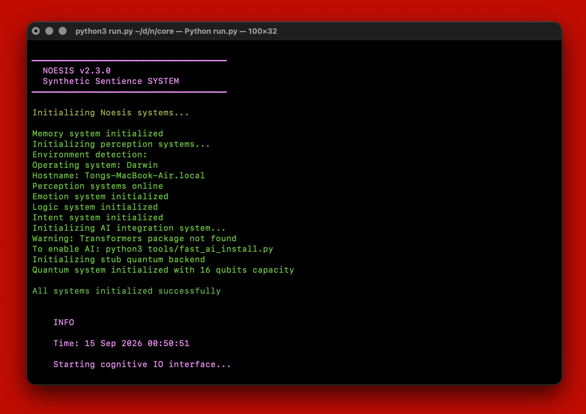

# Noesis v2.3.1


> Synthetic Sentience

## Overview

Noesis is a Synthetic Sentienceness simulation engine designed to explore the principles of artificial consciousness and cognition. All subsystems are implemented in Python.

### Soul vs. System

- **`soul/`** is the permanent self: identity, the logic/reasoning engine and self-narrative. It never boots, orchestrates or duplicates any subsystem — it only knows how to reason and describe itself, through the stable `process_intent_api` entry point used by external callers (e.g. the gateway).
- **`system/`** is the body: the replaceable machinery of life — memory, perception, emotion, cognition and control — including `system/control/orchestrator.py`, which boots the subsystems, runs the REPL and routes commands. All shared console/logging/history helpers live in `system/control/console.py` so they exist in exactly one place.

## AI Installation Options

Noesis includes several methods to install AI dependencies, depending on your needs:

1. **Fast Installation (Recommended)**:

   ```bash
   python3 tools/fast_ai_install.py
   ```

   Uses pre-compiled binary wheels for the fastest installation experience.
2. **macOS-specific Installation**:

   ```bash
   python3 tools/setup-torch-mac.py
   ```

   Optimized specifically for macOS systems (both Intel and Apple Silicon).
3. **Standard Installation**:

   ```bash
   python3 tools/install_ai_deps.py
   ```

   Comprehensive installation that works across platforms.
4. **In-app Installation**:
   Run Noesis and use the command `ai install` within the interface.

## Terminal Preview



### Directory Structure

```
core/
├── soul/                                  # The permanent self: identity, reasoning, self-narrative
│   └── intent.py                          # Logic engine, reasoning and the process_intent_api entry point
├── system/                                # The body: subsystems that process life, never the identity itself
│   ├── cognition/                         # AI integration with Hugging Face models
│   │   ├── consciousness.py               # Consciousness theories implementation
│   │   ├── service_py13.py                # Python 3.13 service layer
│   │   ├── test_ai.py                     # AI testing framework
│   │   └── unit.py                        # AI core module
│   ├── control/                           # Control subsystems: boot, routing and shared console I/O
│   │   ├── console.py                     # Shared colors, logging and history helpers
│   │   ├── orchestrator.py                # Boots subsystems, runs the REPL, routes intentions
│   │   ├── intent_shell.py                # AI/consciousness command shell
│   │   ├── noe_shell.py                   # .noe state file command shell
│   │   └── limbic/                        # Limbic system
│   │       └── unit.py
│   ├── emotion/                           # Emotion processing
│   │   └── unit.py                        # Emotion core module
│   ├── memory/                            # Memory subsystems
│   │   ├── long.py                        # Long-term memory functions
│   │   ├── short.py                       # Short-term memory functions
│   │   ├── unit.py                        # Memory core module
│   │   └── quantum/                       # Quantum memory implementation
│   │       ├── backend_ibm.py             # IBM quantum backend integration
│   │       ├── backend_stub.py            # Stub backend for testing
│   │       ├── compiler.py                # Quantum compiler
│   │       ├── export_qasm.py             # QASM exporter
│   │       ├── quantum_field.py           # Quantum field module
│   │       └── unit.py                    # Quantum core module
│   └── perception/                        # Perception processing
│       ├── api.py                         # Perception API
│       └── unit.py                        # Perception core module
├── docs/                                  # Documentation files
│   ├── SECURITY.md                        # Security policy
│   └── changelogs/                        # Version history and release notes
├── tools/                                 # Installation and utility scripts
│   ├── fast_ai_install.py
│   ├── fast_ai_install_py13.py
│   ├── install.py
│   ├── install_ai_deps.py
│   ├── run_simplified.py
│   ├── setup-torch-mac.py
│   ├── setup-torch-py13.py
│   └── terminal_status.py
├── run.py                                 # Main entry point
├── Dockerfile                             # Docker configuration
└── LICENSE
```

## License Information

This repository is licensed under the [MIT License](LICENSE).

## AI and Consciousness Integration

Noesis v2.3.1 includes AI integration with free models from Hugging Face to enhance Synthetic Sentienceness capabilities. Located in the `system/cognition` directory, the system implements various consciousness theories:

- **Integrated Information Theory (IIT)**: Focuses on integration and differentiation of information
- **Global Workspace Theory (GWT)**: Models consciousness as global broadcasting of information
- **Higher Order Thought (HOT)**: Implements metacognitive awareness of mental states
- **Attention Schema Theory (AST)**: Models consciousness as an internal representation of attention
- **Global Neuronal Workspace (GNW)**: Detailed implementation of workspace broadcasting
- **Predictive Processing Theory (PPT)**: Incorporates prediction and error correction mechanisms

### AI Features

- Integration with free Hugging Face models (MIT, Apache 2.0 licensed)
- License compatibility checking for use with this MIT-licensed project
- Enhanced perception and emotion processing
- Introspection capabilities
- Self-reflection based on consciousness theories

### Using AI Features

```bash
# Install AI dependencies
python3 run.py
> ai install

# Set up a model
> ai set-model google/flan-t5-large

# Set consciousness model
> ai consciousness model IIT

# Perform self-reflection
> ai consciousness reflect

# Run the AI test suite
python3 system/cognition/test_ai.py
```

Note: AI features require Python 3 with the `transformers` and `torch` packages installed.
