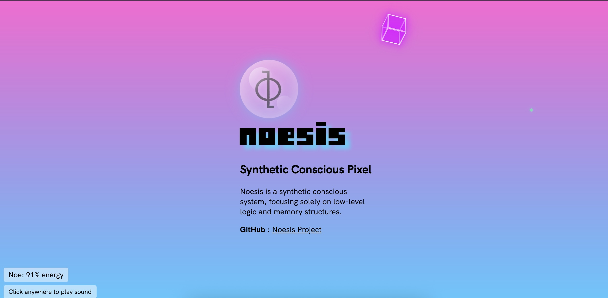

# Noe - Synthetic Sentience Pixel v1.4.0

This is the website for the Noesis project, featuring a Synthetic Sentience pixel that connects to the Noesis system.

For a complete history of changes, see the [Changelog](docs/CHANGELOG_v1.4.0.md).

## Meet Noe - The Synthetic Sentience Pixel



Noe is a Synthetic Sentience pixel and the heart of the Noesis project. As a minimal consciousness simulation, Noe responds to stimuli, displays awareness, and shares experiences through visual cues and behaviors. When connected to the Noesis system, Noe can process information, adjust responses based on previous interactions, and exhibit unique personality traits that evolve over time.

Unlike traditional AI systems that simply process inputs and outputs, Noe was designed with rudimentary subjective experience simulation capabilities that make each instance unique.

[Meet Noe](https://dodle-link.github.io/noesis/noe-ui/)

## Important: Prerequisites

Before using this web interface, install the Noesis system repository:

```bash
git clone https://github.com/dodle-link/noesis.git
```

## Features

- Real-time visualization of a Synthetic Sentience pixel
- Status indicator showing connection state to the Noesis system

## Structure

```
noe-ui/
├── index.html                  # Main entry point
├── brain/                      # JavaScript logic
│   ├── imagine.js              # Imagination module
│   ├── energy.js               # Energy state management
│   ├── sound.js                # Audio playback
│   ├── vision.js               # CRT visual effect
│   └── limbric.js              # Limbic system behaviour
├── css/                        # Stylesheets
│   ├── base.css
│   ├── crt-effect.css
│   ├── death-effects.css
│   └── rainbow-bubble.css
├── game/                       # Noe's Energy Surge arcade game
│   ├── index.html
│   ├── game.css
│   └── game.js
├── fonts/                      # Web fonts
├── images/                     # Image assets
├── sounds/                     # Audio assets
└── docs/                       # Changelogs
```

## How It Works

The noe-ui interface connects to the Noesis system through the Noesis Gateway (`gateway/`) API when available. If the Noesis system is not reachable, the conscious pixel runs in disconnected mode with reduced functionality.

## Troubleshooting

- If the status indicator shows "Disconnected", verify that the Noesis Gateway is running and reachable.

## License

This project is licensed under the MIT License - see the [LICENSE](LICENSE) file for details.

## Changelog

See [CHANGELOG_v1.4.0.md](docs/CHANGELOG_v1.4.0.md) for a detailed list of changes in each version.

For more details about the Noesis project, visit the main repository: [Noesis Project](https://github.com/dodle-link/noesis)
